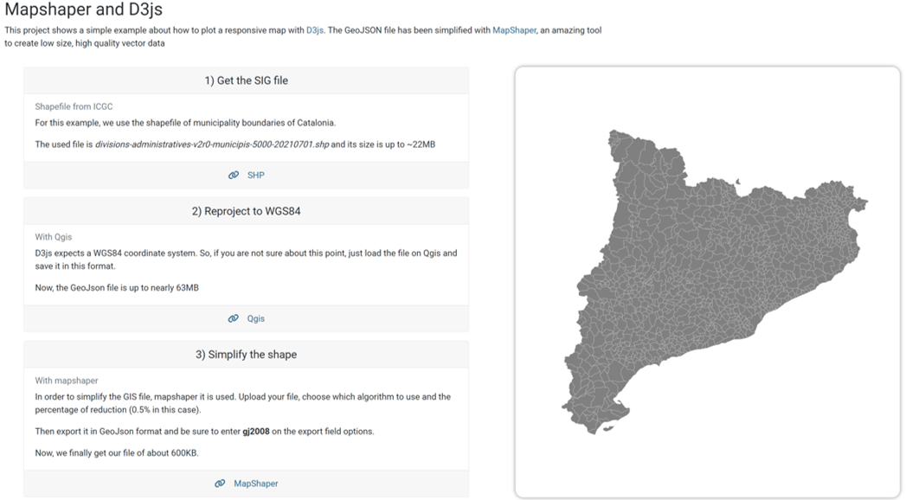

# A responsive map with D3js and mapshaper

This project shows a small tutorial about how to use [D3js](https://d3js.org/) with [mapshaper](https://mapshaper.org/) in order to build a responsive lightweight map.

The few steps can be seen in the HTML file and also check the responsivness of the map. The JS file contains the code used for building the map and its resizing behavior.

# HTML screenshot

